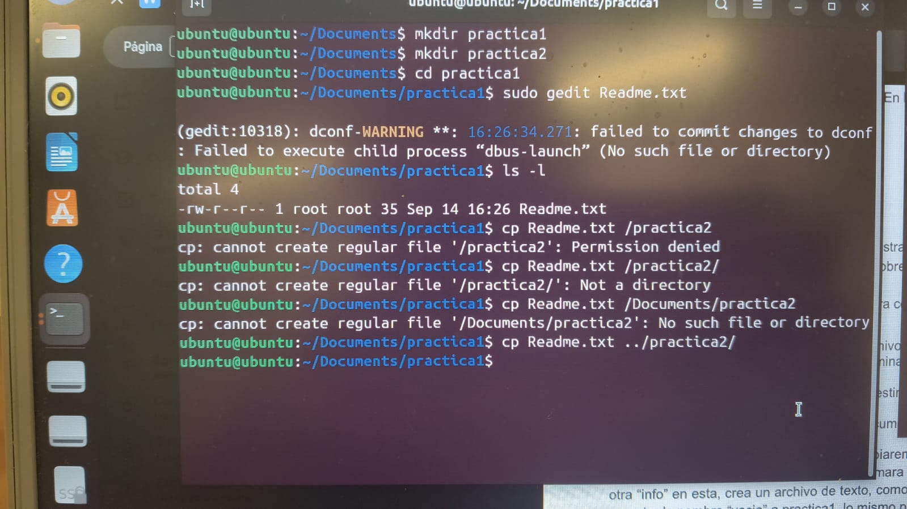
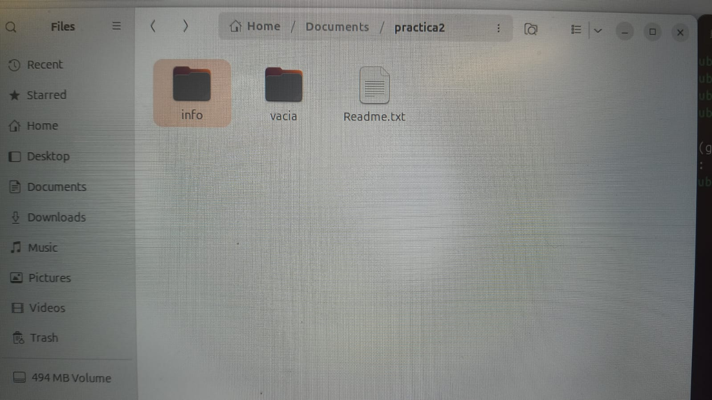
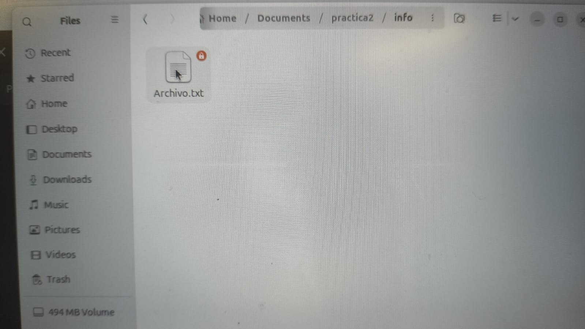
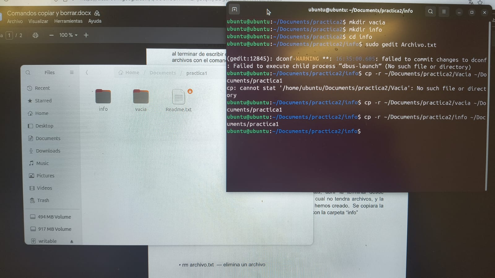
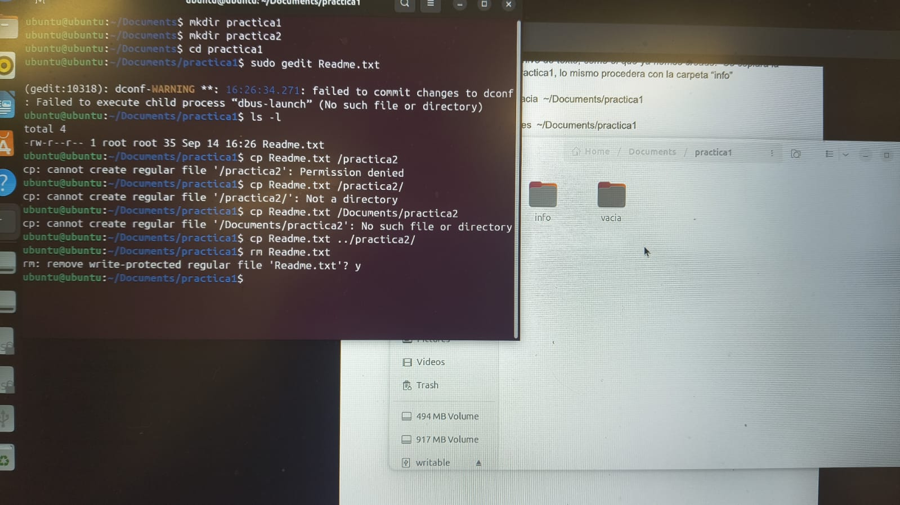
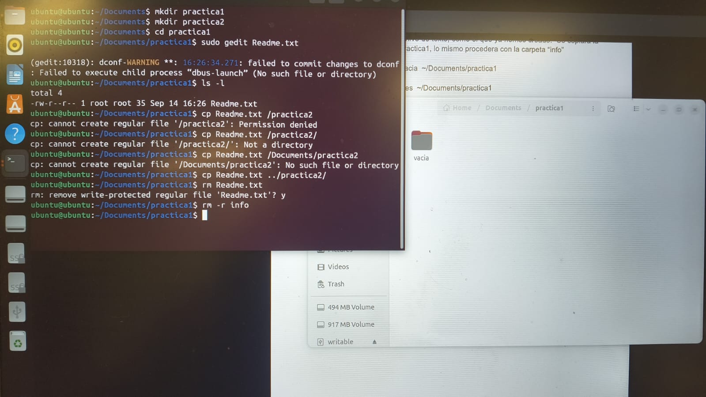

# Crear, copiar, mover y eliminar archivos y carpetas

## Objetivos

- Comprender el funcionamiento de comandos básicos de la terminal de Ubuntu para administrar archivos y carpetas.
- Utilizar `mkdir` para crear directorios.
- Utilizar `cp` para copiar archivos.
- Utilizar `cp -r` para copiar directorios y su contenido.
- Utilizar `rm` para eliminar archivos.
- Utilizar `rm -r` para eliminar directorios y su contenido.
- Comprender el uso de rutas relativas y absolutas durante las operaciones realizadas.

## Explicación de comandos

Durante la práctica se utilizaron diferentes comandos de la terminal de Ubuntu para crear, consultar, copiar y eliminar archivos y carpetas.

El comando `mkdir` se utilizó para crear las carpetas de trabajo de la práctica.

El comando `ls -l` permitió consultar el contenido de una carpeta mostrando información detallada de los archivos.

El comando `cp` se utilizó para copiar el archivo `Readme.txt` desde `practica1` hacia `practica2`. Durante esta operación también se trabajó con rutas relativas para indicar la ubicación del archivo de destino.

La opción `-r` del comando `cp` se utilizó para copiar las carpetas `Vacia` e `info` junto con su contenido.

Finalmente, el comando `rm` se utilizó para eliminar el archivo `Readme.txt`, mientras que `rm -r` permitió eliminar la carpeta `info` junto con su contenido.

## Código

Los comandos utilizados durante la práctica se encuentran en el archivo:

[Ver código](Codigo/readme.txt)

## Terminal

Las capturas de la terminal muestran de forma nítida los comandos ejecutados durante la práctica y los resultados obtenidos.

[Ver carpeta Terminal](Terminal)

## Video

El video muestra en vivo el funcionamiento de los comandos utilizados durante la práctica.

[Ver información del video](Video/readme.txt)

[Ver video en YouTube](https://youtu.be/gHyKnqPOEjU)

## Reporte

El reporte contiene el análisis del comportamiento del sistema operativo y la justificación teórica de las observaciones realizadas durante la práctica.

[Ver Reporte](Reporte/Reporte.pdf)

## Conclusiones técnicas

La práctica permitió comprender el funcionamiento de diferentes comandos de la terminal de Ubuntu para administrar archivos y directorios. `mkdir` permite crear directorios, mientras que `cp` y `cp -r` permiten copiar archivos y carpetas respectivamente.

También se comprendió la diferencia entre rutas absolutas y relativas y la forma en que estas determinan la ubicación de los archivos y directorios durante las operaciones realizadas.

Finalmente, los comandos `rm` y `rm -r` permitieron eliminar archivos y directorios. Las actividades demostraron la importancia de utilizar correctamente las rutas y verificar los elementos antes de realizar operaciones de copia o eliminación.

