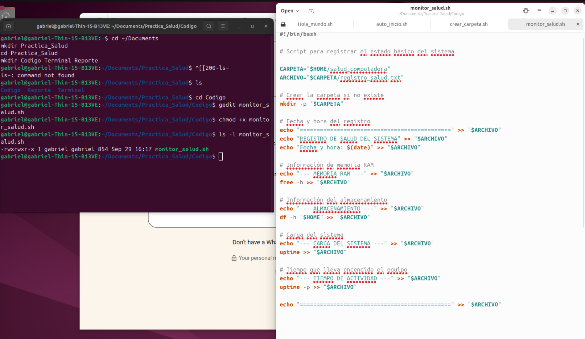
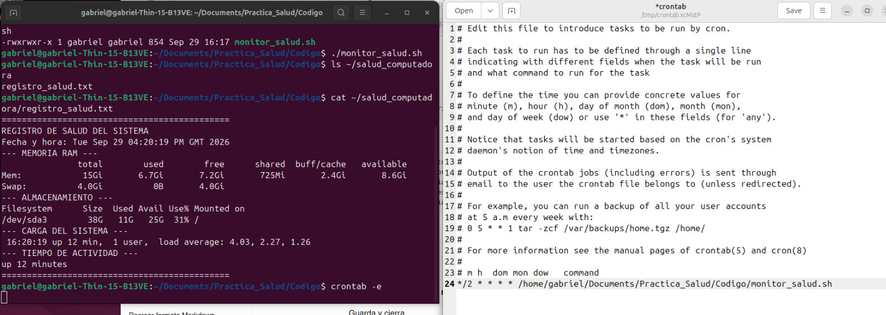
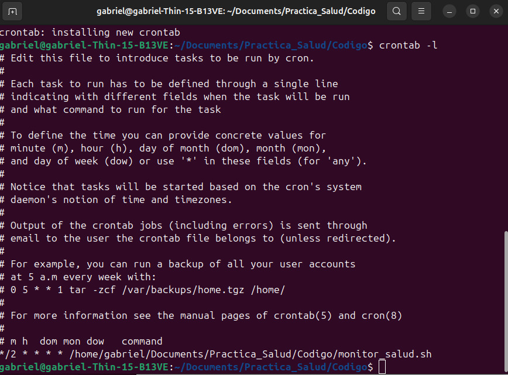
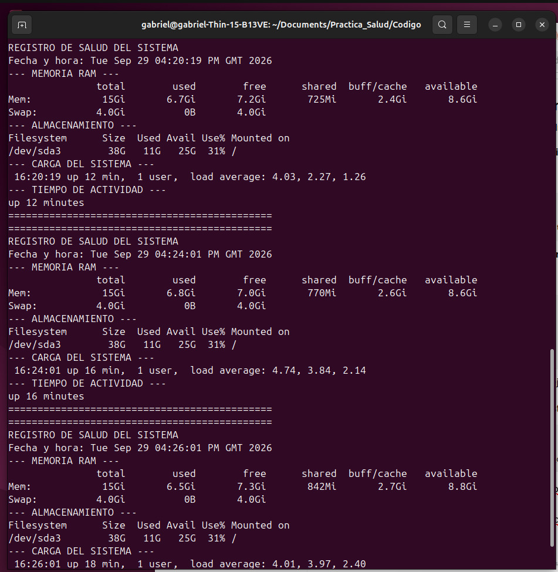
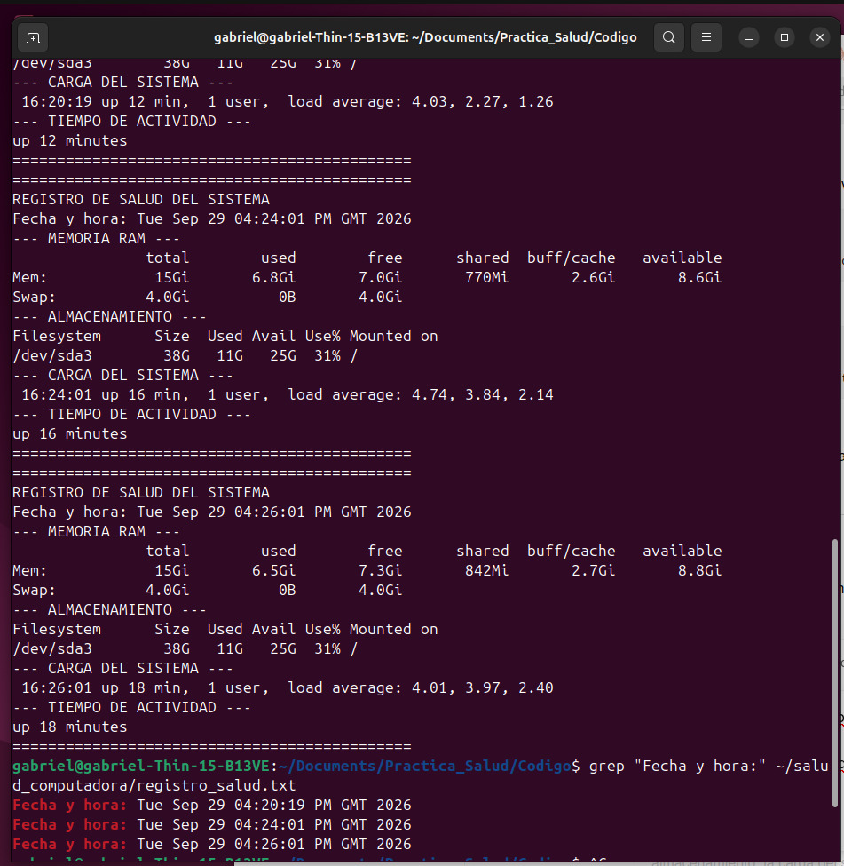

# Monitoreo de la salud del sistema en Ubuntu

## Descripción

Esta práctica consiste en desarrollar un script en Bash para registrar información básica sobre el estado de una computadora con Ubuntu Desktop.

El script obtiene información relacionada con el uso de la memoria RAM, el almacenamiento, la carga del sistema y el tiempo de actividad del equipo. La información se guarda en un archivo dentro de la carpeta personal del usuario.

Para automatizar el proceso se utiliza `cron`, configurando una tarea que ejecuta el script cada 2 minutos en segundo plano.

## Objetivos de aprendizaje

* Comprender el funcionamiento básico de los scripts en Bash.
* Utilizar comandos de Linux para obtener información del sistema.
* Consultar el uso de la memoria RAM.
* Consultar el espacio utilizado del almacenamiento.
* Obtener información sobre la carga y el tiempo de actividad del sistema.
* Guardar información generada por un script en un archivo de texto.
* Utilizar variables y rutas dentro de un script Bash.
* Automatizar la ejecución de un script mediante `cron`.

## Comandos utilizados

### `chmod`

Permite modificar los permisos de un archivo para poder ejecutar el script.

### `mkdir`

Permite crear directorios. En el script se utiliza para crear la carpeta donde se almacenan los registros.

### `free`

Permite consultar el uso de la memoria RAM y el espacio disponible.

### `df`

Permite consultar el espacio utilizado y disponible en las unidades de almacenamiento.

### `uptime`

Muestra información sobre el tiempo que lleva funcionando el sistema y la carga del sistema.

### `crontab`

Permite programar tareas automáticas para que se ejecuten en determinados intervalos de tiempo.

## Funcionamiento del script

El script crea una carpeta llamada `salud_computadora` dentro de la carpeta personal del usuario y genera un archivo llamado `registro_salud.txt`.

En cada ejecución se registra:

* Fecha y hora.
* Estado de la memoria RAM.
* Uso del almacenamiento.
* Carga del sistema.
* Tiempo de actividad del equipo.

La ejecución automática se configuró mediante `cron` para realizar un registro cada 2 minutos.

## Código

El script utilizado en la práctica se encuentra en la carpeta:

[Ver código](Codigo)

[Ver monitor_salud.sh](Codigo/monitor_salud.sh)

## Evidencias

Las capturas muestran la ejecución del script, la configuración de la tarea automática y los registros generados por el sistema.

[Ver carpeta de evidencias](Terminal)

### Resultado 1

### Resultado 2

### Resultado 3

### Resultado 4

### Resultado 5

## Reporte

El reporte formal de la práctica se encuentra en:

[Ver reporte](Reporte)

[Ver Reporte.pdf](Reporte/Reporte.pdf)

## Video

En la siguiente carpeta se encuentra el video de demostración de la práctica:

[Ver carpeta de video](Video)

[Ver video de la práctica](PON_AQUI_EL_LINK_DEL_VIDEO)

## Conclusiones técnicas

La práctica permitió comprender cómo un sistema Linux puede ser monitoreado mediante un script en Bash y cómo sus tareas pueden automatizarse mediante `cron`.

El uso de comandos como `free`, `df` y `uptime` permitió obtener información relevante sobre los recursos del sistema, mientras que el uso de archivos de texto permitió conservar un historial de los registros obtenidos.

La automatización mediante `cron` permite realizar estas comprobaciones periódicamente sin necesidad de ejecutar manualmente el script, facilitando el seguimiento del estado de la computadora.
