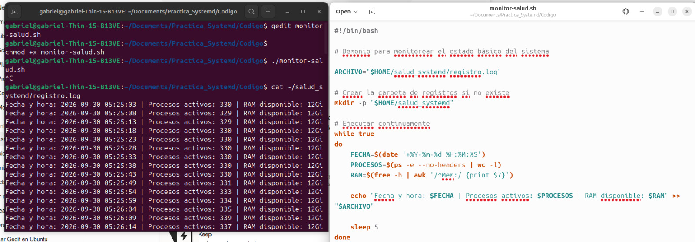
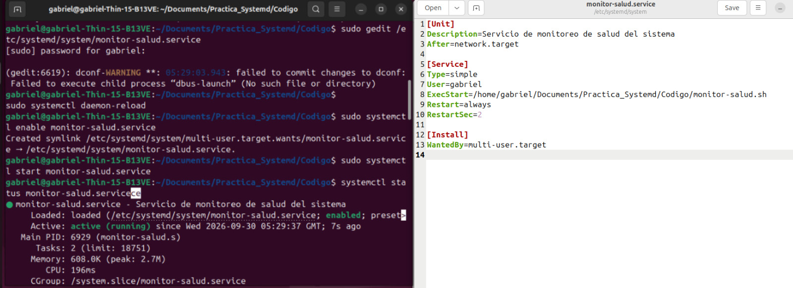
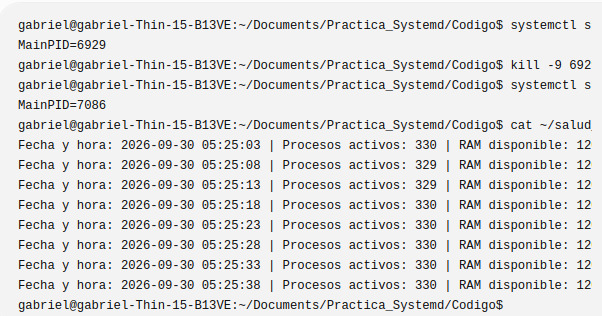

# Demonio

## Descripción

Esta práctica tiene como propósito crear y administrar un demonio mediante systemd en Ubuntu. Se desarrolló un monitor que registra periódicamente información del sistema, como la fecha y hora, la cantidad de procesos activos y la memoria RAM disponible.

También se configuró el servicio para que pueda ser administrado mediante systemctl y se comprobó su funcionamiento al finalizar manualmente el proceso principal, verificando que systemd lo iniciara nuevamente.

## Objetivos de aprendizaje

- Comprender el funcionamiento de los servicios administrados por systemd.
- Crear y configurar un servicio personalizado.
- Ejecutar un script como un servicio del sistema.
- Utilizar systemctl para administrar y verificar el estado de un servicio.
- Configurar el reinicio automático de un servicio.
- Registrar información del sistema en un archivo de log.
- Comprobar el funcionamiento de un demonio mediante su PID y su archivo de registro.

## Material utilizado

- Ubuntu
- Terminal
- Bash
- systemd
- systemctl
- Editor de texto Gedit
- Archivo de servicio `monitor-salud.service`
- Script `monitor-salud.sh`

## Código

En esta carpeta se encuentra el script utilizado para realizar el monitoreo del sistema y el archivo relacionado con la configuración del demonio.

[Ver código](Codigo/)

## Evidencias de terminal

### Creación del monitor y primer registro

### Creación y comprobación del demonio

### Reinicio automático y registro del monitor

[Ver todas las evidencias](Terminal/)

## Reporte

El reporte formal de la práctica se encuentra en:

[Ver reporte](Reporte)

[Ver Reporte.pdf](Reporte/Reporte.pdf)

## Video

En la siguiente carpeta se encuentra el video de demostración de la práctica:

[Ver carpeta de video](Video)

[Ver video de la práctica](https://youtu.be/9e3agb-fALY)

## Conclusión

La práctica permitió comprender el funcionamiento de un demonio administrado mediante systemd y la forma en que un servicio puede ejecutarse de manera continua en segundo plano. También se comprobó el reinicio automático del proceso al finalizarlo manualmente y se verificó la generación periódica de información en el archivo de registro.
